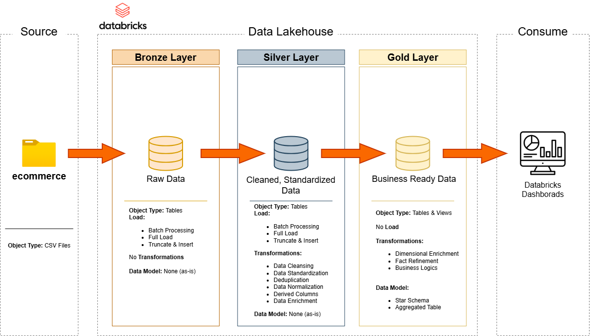
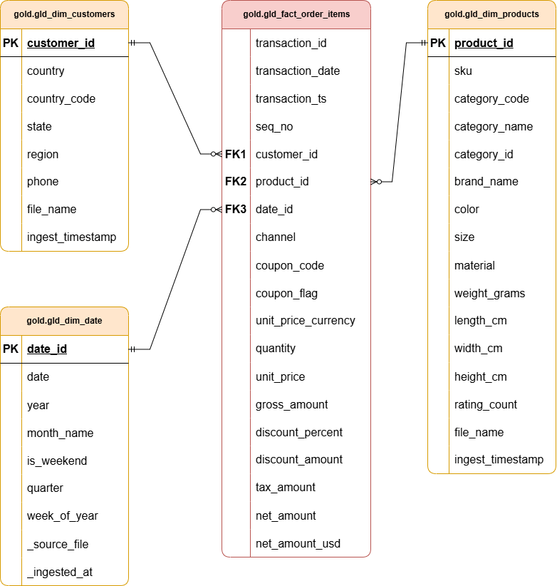

# E-commerce Data Pipeline on Databricks

Welcome to the **E-commerce Data Pipeline on Databricks** repository!

This project showcases a complete, production-style data engineering pipeline built on Databricks using the Medallion Architecture. It demonstrates how raw e-commerce data can be ingested, cleaned, transformed, and aggregated into analytics ready datasets for business intelligence and reporting.

## Data Architecture

The data architecture for this project follows Medallion Architecture **Bronze**, **Silver**, and **Gold** to create a scalable and reliable Data Lakehouse:

**Bronze Layer**: Stores raw data as-is from the source system. Data is ingested from CSV Files into Delta Tables. This layer preserves the original state of the data while adding metadata columns for auditability and lineage tracking.

**Silver Layer**: This layer includes data cleansing, standardization, and validation. Key transformations involve renaming columns for consistency, handling null values, correcting data types, and trimming whitespace to ensure high-quality data for downstream consumption.

**Gold Layer**: Houses business-ready data modeled into a Star Schema optimized for high-performance analytics. This layer consists of four refined dimension tables (gld_dim_customers, gld_dim_date, gld_dim_products) and one fact table (gld_fact_order_items). It also includes a denormalized view (fact_transactions_denorm) specifically designed to power Databricks Dashboards and ad-hoc SQL queries.

---

## Objective
Develop a modern Data Lakehouse using Databricks to consolidate e-commerce sales data, enabling high-performance analytical reporting and informed decision-making through a structured Medallion Architecture.

---

## Data Modeling
The Gold Layer is architected as a Star Schema to ensure high-performance querying and ease of use for BI tools. You can view the entity-relationship diagram (ERD) below:

Detailed descriptions of every column, data type, and description are available in the Data Catalog, which can be found in the `/docs` folder of this repository.

---

## Data Lineage & Auditability
To maintain high data integrity and transparency, this project implements automated lineage tracking. Every table across the Bronze, Silver, and Gold layers includes audit metadata:

`ingest_timestamp`: Records the exact UTC time the record was pro
cessed, allowing for point-in-time analysis.

`source_file`: Captures the specific path of the raw file origin, enabling us to trace any data quality issue back to its source.

---

## Gold View
To simplify reporting and improve performance for Databricks Dashboards, I created a denormalized view: fact_transactions_denorm.

This view abstracts the complexity of the Star Schema by pre-joining the Fact and Dimension tables, allowing business users to query one single source for all sales, product, and customer metrics.

---

## Business Insights & Dashboards
The final Gold layer feeds into interactive Databricks Dashboards, providing stakeholders with insights into sales performance and product trends.

## License

This project is licenced under the [MIT License](LICENSE). You are free to use, modify, and share this project with proper attribution. 
